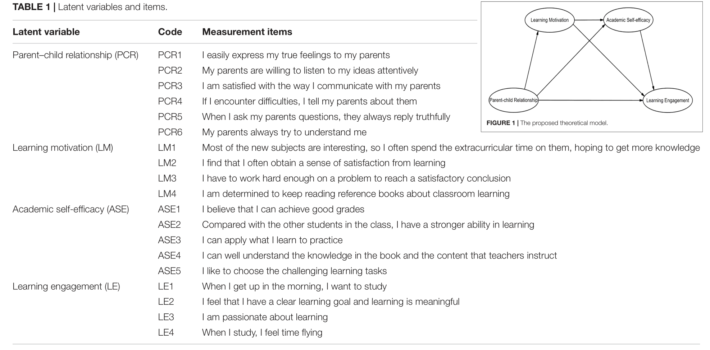
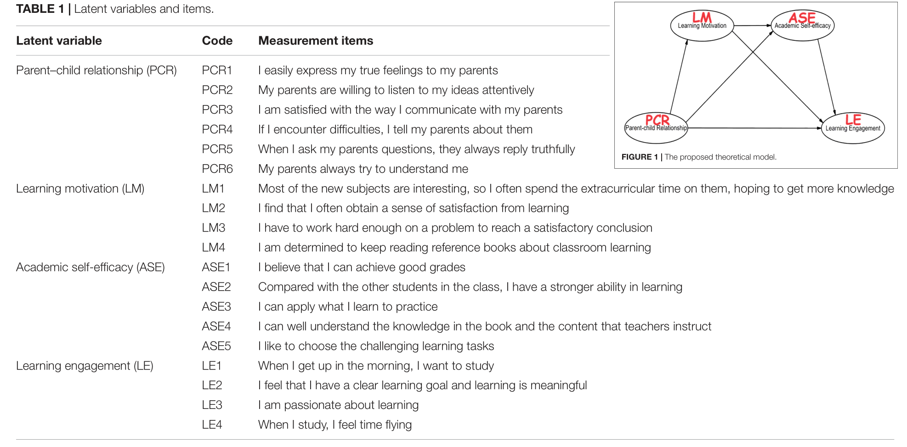
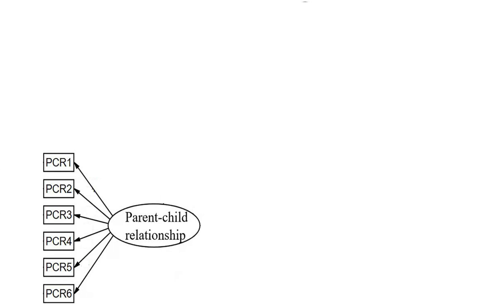
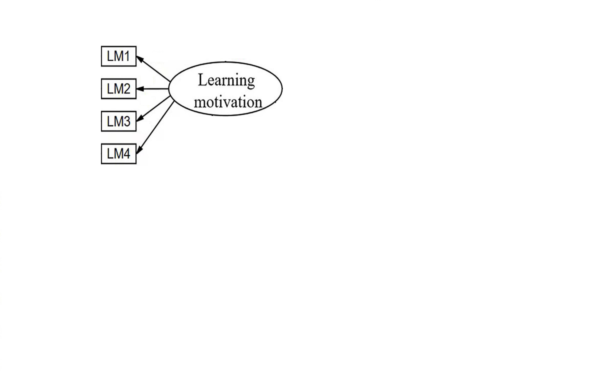
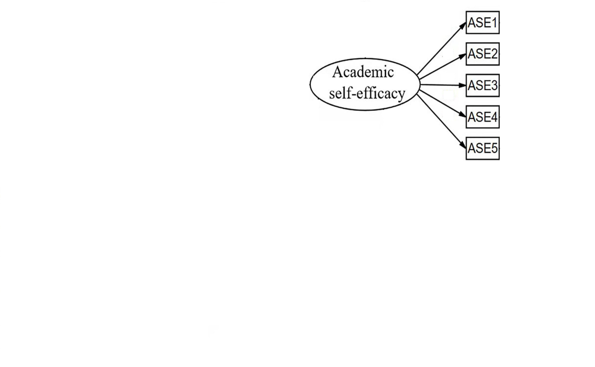
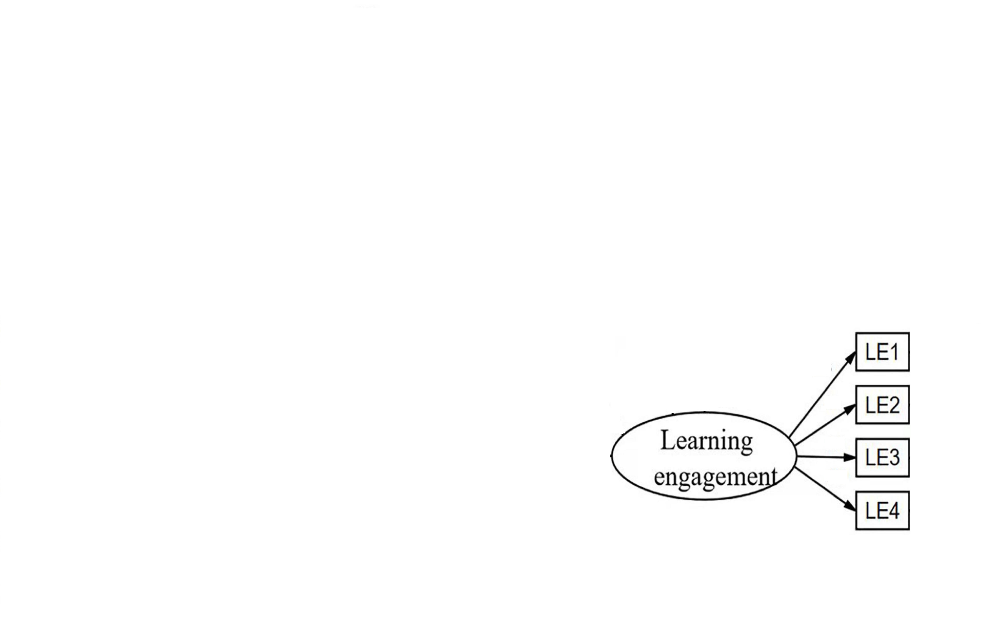
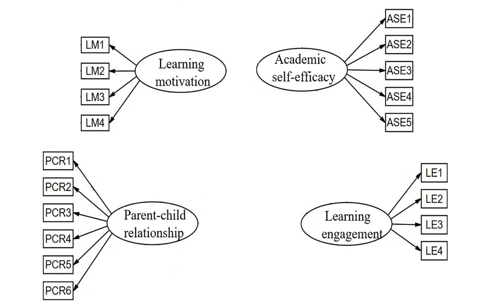
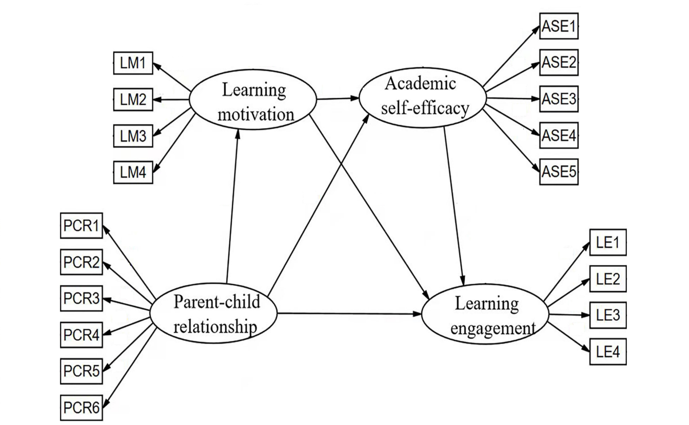
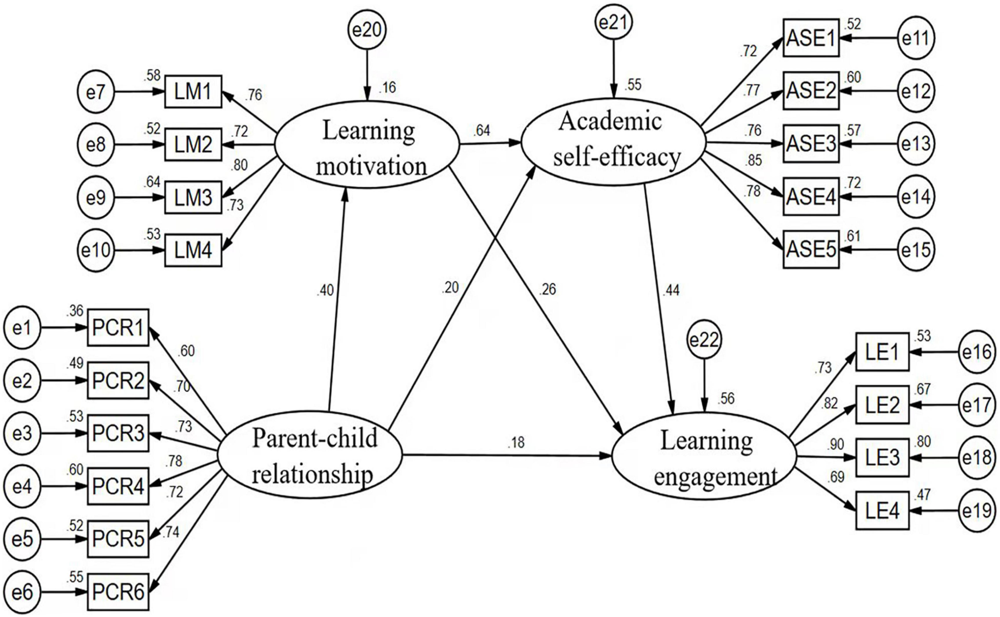
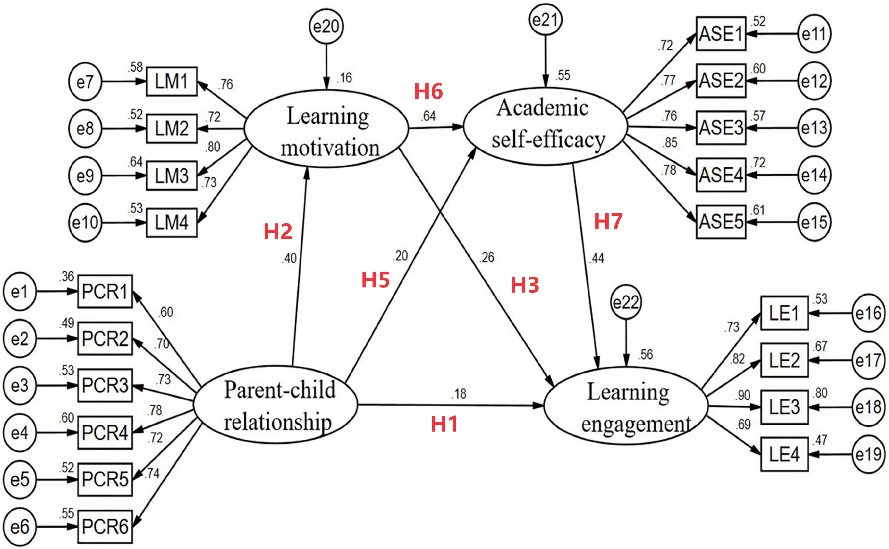

```{r setup, include=FALSE}
knitr::opts_chunk$set(
  echo       = TRUE,
  message    = FALSE,
  warning    = FALSE,
  out.width  = "100%",
  fig.asp    = 0.518, 
  fig.show   = "hold",
  fig.pos    = "center",
  fig.align  = "center",
  dpi        = 600
)

options(
  digits = 3,
  knitr.table.format = "html"
)
```


---
## 目标论文

<br>
<br>
```{r, echo=FALSE}

```

.center[<https://www.frontiersin.org/articles/10.3389/feduc.2022.854549/full>]


---
## 论文思路

```{r, echo=FALSE}

```


---
## 论文思路

```{r, echo=FALSE}

```


---
class: center, middle

# 复现开始


---
## Confirmatory Factor Analysis


.pull-left[

```{r, echo=FALSE}

```

]


.pull-right[

.small[
```{r, eval=FALSE}
library(lavaan)

model <- '

  PCR   =~ PCR1 + PCR2 + PCR3 + PCR4 + PCR5 + PCR6


'


fit <- cfa(model, data = rawdata) 
```

]

]


---
## Confirmatory Factor Analysis


.pull-left[

```{r, echo=FALSE}

```

]


.pull-right[

.small[
```{r, eval=FALSE}
library(lavaan)

model <- '

   LM    =~ LM1 + LM2 + LM3 + LM4


'


fit <- cfa(model, data = rawdata) 
```

]

]


---
## Confirmatory Factor Analysis


.pull-left[

```{r, echo=FALSE}

```

]


.pull-right[

.small[
```{r, eval=FALSE}
library(lavaan)

model <- '

  ASE   =~ ASE1 + ASE2 + ASE3 + ASE4 + ASE5 


'


fit <- cfa(model, data = rawdata) 
```

]

]


---
## Confirmatory Factor Analysis


.pull-left[

```{r, echo=FALSE}

```

]


.pull-right[

.small[
```{r, eval=FALSE}
library(lavaan)

model <- '

  LE    =~ LE1 + LE2 + LE3 + LE4


'


fit <- cfa(model, data = rawdata) 
```

]

]


---
## Measurement Model


.pull-left[

```{r, echo=FALSE}

```

]


.pull-right[

.small[
```{r, eval=FALSE}
library(lavaan)

model <- '

  PCR   =~ PCR1 + PCR2 + PCR3 + PCR4 + PCR5 + PCR6
  LE    =~ LE1 + LE2 + LE3 + LE4
  ASE   =~ ASE1 + ASE2 + ASE3 + ASE4 + ASE5 
  LM    =~ LM1 + LM2 + LM3 + LM4

'


fit_cfa <- cfa(model, data = rawdata)  
```

]

]


---
## Structural Model


.pull-left[

```{r, echo=FALSE}

```

]


.pull-right[

.small[
```{r, eval=FALSE}
library(lavaan)

model <- '

  PCR   =~ PCR1 + PCR2 + PCR3 + PCR4 + PCR5 + PCR6
  LE    =~ LE1 + LE2 + LE3 + LE4
  ASE   =~ ASE1 + ASE2 + ASE3 + ASE4 + ASE5 
  LM    =~ LM1 + LM2 + LM3 + LM4

  LM    ~  PCR                    #<<
  ASE   ~  PCR + LM               #<<
  LE    ~  PCR + LM + ASE         #<<

'


fit_sem <- sem(model, data = rawdata)  
```

]

]


---
## Structural Model


.pull-left[

```{r, echo=FALSE}

```

]


.pull-right[

.small[
```{r, eval=FALSE}
library(lavaan)

model <- '

  PCR   =~ PCR1 + PCR2 + PCR3 + PCR4 + PCR5 + PCR6
  LE    =~ LE1 + LE2 + LE3 + LE4
  ASE   =~ ASE1 + ASE2 + ASE3 + ASE4 + ASE5 
  LM    =~ LM1 + LM2 + LM3 + LM4

  LM    ~  PCR                    
  ASE   ~  PCR + LM               
  LE    ~  PCR + LM + ASE         

'


fit_sem <- sem(model, data = rawdata)  

fit_sem %>%              #<<
  parameterEstimates()   #<<
```

]
]


---
## Hypotheses Tested

.pull-left[

```{r, echo=FALSE}

```

]


.pull-right[

.small[
```{r, eval=FALSE}
library(lavaan)

model <- '

  PCR   =~ PCR1 + PCR2 + PCR3 + PCR4 + PCR5 + PCR6
  LE    =~ LE1 + LE2 + LE3 + LE4
  ASE   =~ ASE1 + ASE2 + ASE3 + ASE4 + ASE5 
  LM    =~ LM1 + LM2 + LM3 + LM4

  LM    ~  H2*PCR                     #<<
  ASE   ~  H5*PCR + H6*LM             #<<
  LE    ~  H1*PCR + H3*LM + H7*ASE    #<<

'


fit_sem <- sem(model, data = rawdata)  
```

]

]


---
## Analyses of the Mediating Effect


.pull-left[

```{r, echo=FALSE}

```

]


.pull-right[

.small[
```{r, eval=FALSE}
library(lavaan)

model <- '

  PCR   =~ PCR1 + PCR2 + PCR3 + PCR4 + PCR5 + PCR6
  LE    =~ LE1 + LE2 + LE3 + LE4
  ASE   =~ ASE1 + ASE2 + ASE3 + ASE4 + ASE5 
  LM    =~ LM1 + LM2 + LM3 + LM4

  LM    ~  H2*PCR                     
  ASE   ~  H5*PCR + H6*LM             
  LE    ~  H1*PCR + H3*LM + H7*ASE    


  DistalIE     := H2*H6*H7                    #<<
  LMIE         := H2*H3                       #<<
  ASEIE        := H5*H7                       #<<
  TIE          := DistalIE + LMIE + ASEIE     #<<  
  DE           := H1                          #<<
  TE           := TIE + DE                    #<<

'


fit_sem <- sem(model, data = rawdata)  
```

]

]


---
class: center, middle

# 感谢 R 和 Stan 语言之美!

本幻灯片由 R 包 [**xaringan**](https://github.com/yihui/xaringan) 和 [**flipbookr**](https://github.com/EvaMaeRey/flipbookr) 生成

